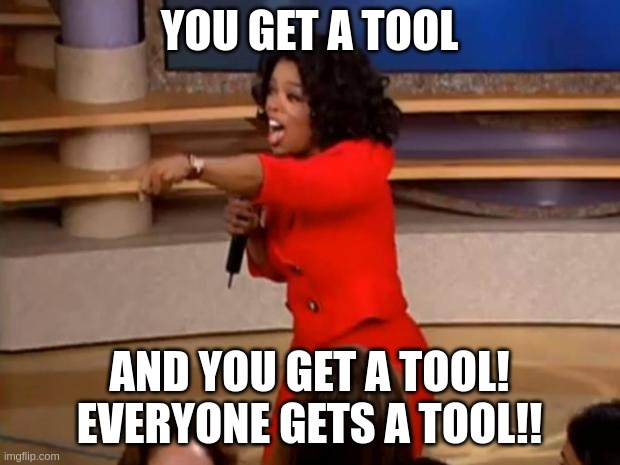

---
---
## Constant-timeness verification tools

This page lists tools for testing and verification of constant-timeness of programs.
The table is based mostly on the work in [*“They’re not that hard to mitigate”: What Cryptographic Library Developers Think About Timing Attacks*](https://crocs.fi.muni.cz/public/papers/usablect_sp22) with addition of more tools. 
Each tool has its own page with more information and resources, sometimes **even a tutorial on using the tool**.

## Tools

<table>
<thead>
	<th>Name</th>
	<th>Year</th>
	<th>Target</th>
	<th>Technique</th>
	<th>Guarantees</th>
	<th>Tutorial</th>
</thead>


	
	<tr>
		<td><a href="{{ tool.url | relative_url }}">{{ tool.title }}</a></td>
		<td>{{ tool.year }}</td>
		<td>{{ tool.target }}</td>
		<td>{{ tool.technique }}</td>
		<td>{{ tool.guarantees }}</td>
		<td><a href="{{ tutorials[0].url | relative_url }}">yes</a></td>
	</tr>

</table>

## Examples

The following list constains short snippets of C code that exhibit constant-time (or not) behavior and
can be useful for testing constant-timeness verification tools, or learning how to use them.


<ul>

	<li><a href="{{ example.url | relative_url }}">{{ example.title }}.c</a> (dependsCTnon-CT)</li>

</ul>
## Resources

- <https://neuromancer.sk/article/26>
- <https://crocs.fi.muni.cz/public/papers/usablect_sp22>
- <https://neuromancer.sk/article/29>

